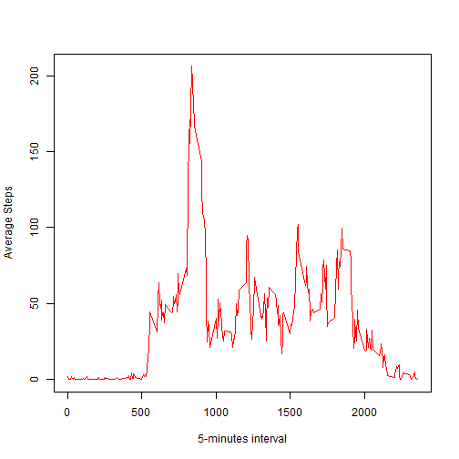
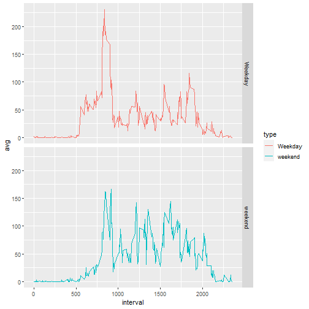

## Loading and preprocessing the data

1. Load the data (i.e. read.csv())

```r
unzip(zipfile = "./activity.zip", 
      files = NULL, 
      overwrite = TRUE, 
      junkpaths = FALSE, 
      exdir = "./data")


data <- read.csv("./data/activity.csv")
```

2. Process/transform the data (if necessary) into a format suitable for your analysis

```r
library(dplyr)
tbl_df(data)
```

```
## Warning: `...` is not empty.
## 
## We detected these problematic arguments:
## * `needs_dots`
## 
## These dots only exist to allow future extensions and should be empty.
## Did you misspecify an argument?
```


## What is mean total number of steps taken per day?

1. Calculate the total number of steps taken per day

```r
Steps.day <- data %>%
  group_by(date) %>%
  summarise(steps.day = sum(steps, na.rm = TRUE))
```

```
## `summarise()` ungrouping output (override with `.groups` argument)
```

```r
head(Steps.day)
```

```
## Warning: `...` is not empty.
## 
## We detected these problematic arguments:
## * `needs_dots`
## 
## These dots only exist to allow future extensions and should be empty.
## Did you misspecify an argument?
```

```
## # A tibble: 6 x 2
##   date       steps.day
##   <chr>          <int>
## 1 2012-10-01         0
## 2 2012-10-02       126
## 3 2012-10-03     11352
## 4 2012-10-04     12116
## 5 2012-10-05     13294
## 6 2012-10-06     15420
```

2.Make a histogram of the total number of steps taken each day

```r
hist(Steps.day$steps.day, main = "** steps per day **",
     xlab = "days", ylab = "Steps")
```


3. Calculate and report the mean and median of the total number of steps taken per day

```r
mean(Steps.day$steps.day)
```

```
## [1] 9354.23
```

```r
median(Steps.day$steps.day)
```

```
## [1] 10395
```


## What is the average daily activity pattern?

1. Make a time series plot (i.e. type = "l") of the 5-minute interval (x-axis) and the average number of steps taken, averaged across all days (y-axis)

```r
AvgStepsInterval <- data %>%
  group_by(interval) %>%
  summarise(avg = mean(steps, na.rm = TRUE))
```

```
## `summarise()` ungrouping output (override with `.groups` argument)
```

```r
plot(AvgStepsInterval$interval, AvgStepsInterval$avg, type = "l",
     xlab = "5-minutes interval", ylab = "Average Steps", col = "red")
```



2. Which 5-minute interval, on average across all the days in the dataset, contains the maximum number of steps?

```r
df1 <- data.frame(AvgStepsInterval)
df1[which(df1$avg == max(df1$avg)),1]
```

```
## [1] 835
```


## Imputing missing values

1. Calculate and report the total number of missing values in the dataset (i.e. the total number of rows with NAs)

```r
sum(is.na(data$steps))
```

```
## [1] 2304
```

2. Devise a strategy for filling in all of the missing values in the dataset. The strategy does not need to be sophisticated. For example, you could use the mean/median for that day, or the mean for that 5-minute interval, etc.
and
3. Create a new dataset that is equal to the original dataset but with the missing data filled in.
### the missing calues will be filled with the average number of steps per interval

```r
data2 <- data

data2[is.na(data2$steps), 1] <- df1$avg
head(data2)
```

```
##       steps       date interval
## 1 1.7169811 2012-10-01        0
## 2 0.3396226 2012-10-01        5
## 3 0.1320755 2012-10-01       10
## 4 0.1509434 2012-10-01       15
## 5 0.0754717 2012-10-01       20
## 6 2.0943396 2012-10-01       25
```

4. Make a histogram of the total number of steps taken each day and Calculate and report the mean and median total number of steps taken per day. Do these values differ from the estimates from the first part of the assignment? What is the impact of imputing missing data on the estimates of the total daily number of steps?


```r
Steps.day2 <- data2 %>%
  group_by(date) %>%
  summarise(steps.day = sum(steps, na.rm = TRUE))
```

```
## `summarise()` ungrouping output (override with `.groups` argument)
```

```r
hist(Steps.day2$steps.day, main = "** steps per day **",
     xlab = "days", ylab = "Steps")
```


```r
mean(Steps.day2$steps.day)
```

```
## [1] 10766.19
```

```r
median(Steps.day2$steps.day)
```

```
## [1] 10766.19
```

The values after imputation has changed, which indicates the effect of missing values and the estimation method used on the results ...


## Are there differences in activity patterns between weekdays and weekends?

1. Create a new factor variable in the dataset with two levels -- "weekday" and "weekend" indicating whether a given date is a weekday or weekend day.

```r
Steps.day2$date <- as.Date(Steps.day2$date)
weekdays(Steps.day2$date)

days <- rep(rep(c("Weekday", "weekend"), times = c(5,2)), 9)
Steps.day2$type <- days[1:61]
Steps.day2$type <- as.factor(Steps.day2$type)


data2$date <- as.Date(data2$date)
data2 <- left_join(data2, Steps.day2, by = "date")
```

2. Make a panel plot containing a time series plot (i.e. type = "l") of the 5-minute interval (x-axis) and the average number of steps taken, averaged across all weekday days or weekend days (y-axis). The plot should look something like the following, which was created using simulated data:

```r
AvgStepsInterval2 <- data2 %>%
  group_by(type, interval) %>%
  summarise(avg = mean(steps, na.rm = TRUE))
```

```
## `summarise()` regrouping output by 'type' (override with `.groups` argument)
```

```r
library(ggplot2)
ggplot(data = AvgStepsInterval2, aes(interval, avg, color = type)) +
  geom_line() + facet_grid(type~.)
```



